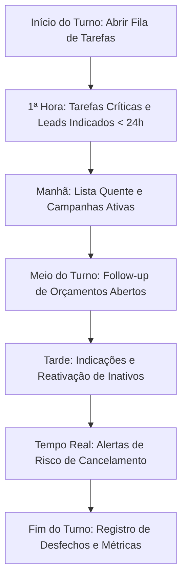

# Plano de Execução Comercial — Inspiração e Implementação Todoo CRM

Documento de referência e planejamento estratégico baseado na análise do [manual_completo_todo.pdf](./manual_completo_todo.pdf).  
Este material serve como guia para a implementação de novas funcionalidades e expansão dos módulos comerciais do **Atendi**.

---

## 1. Visão Geral do Modelo Todoo

O Todoo é um **CRM de execução comercial** projetado para clínicas de estética, redes de serviços e varejo recorrente. Em vez de operar apenas como um cadastro estático de clientes ou histórico de conversas, ele atua como um **motor diário de tarefas comerciais**, respondendo às três perguntas essenciais de cada consultora todos os dias:

1. **Quem devo contatar hoje?** (Priorização inteligente de contatos por criticidade e probabilidade de compra)
2. **Qual oferta devo apresentar?** (Campanhas segmentadas, reativações, upsell, combos)
3. **O que aconteceu com cada atendimento?** (Registro obrigatório de desfechos para alimentar métricas e ranking)

---

## 2. Módulos Analisados e Mapeamento para o Atendi

| Módulo Todoo | Propósito no Todoo | Equivalente / Oportunidade no Atendi |
| :--- | :--- | :--- |
| **Lista Quente + Campanhas** | Segmentação de base com alta propensão de compra (reativação de inativos, renovação, pacotes). | Expandir o módulo `campaigns.tsx` e o filtro de contatos com listas dinâmicas geradas por IA/regras de inatividade. |
| **Pedir Indique** | Transformar clientes satisfeitos em fontes de novos leads (*Member Get Member*) logo após momentos felizes. | Criar ação rápida no `ChatPanel` ou no Copilot/Sales Coach sugerindo mensagem de indicação com link único após atendimento positivo. |
| **Lead Indicado** | Fila de atendimento prioritária com meta de primeiro contato em até 24h e premiação ao indicador. | Adicionar etiqueta/origem específica no contato (`Origem: Indicação por [Contato X]`) e disparar automação de SLA crítico (24h). |
| **Gincanas (Gamificação)** | Rankings, pontuações e premiações da equipe por conversão, reativação e menos cancelamentos. | Criar aba de Gamificação/Rankings no módulo de relatórios (`reports.tsx`) com score por atendente (SLA, conversão, vendas). |
| **Dashboards de Funil** | Acompanhamento de taxas de contato, agendamento, envio e abertura de propostas e fechamentos. | Enriquecer as métricas de conversão no dashboard principal (`dashboard.tsx`) e pipeline (`pipeline.tsx`). |
| **Lembretes Preditivos** | Alertas do momento ideal para retorno (virada de fatura do cartão, fim de pacote, orçamentos sem resposta). | Integrar o sistema de tarefas (`tasks.tsx`) com gatilhos automáticos baseados no ciclo de vida do cliente. |
| **Meus Orçamentos (Rastreamento)** | Notificação em tempo real quando o cliente abre o link do orçamento para abordagem imediata. | Implementar página/link público de proposta no Atendi com webhook de leitura disparando notificação interna pro atendente. |
| **Retenção & Churn** | Detecção de sinais de risco (queda de visitas, reclamações, inadimplência) com playbook de retenção. | IA do Atendi analisar histórico de mensagens para detectar sentimento negativo e marcar tag automática `Risco de Churn`. |

---

## 3. Matriz de Perfis e Responsabilidades

- **Gestor / Gerente**:
  - Definir metas mensais e quinzenais.
  - Criar e distribuir campanhas para a equipe.
  - Acompanhar gargalos no funil pelo dashboard.
  - Conduzir reuniões de alinhamento e premiar os destaques das gincanas.

- **Consultora / Vendedora**:
  - Abrir a fila de tarefas no início do turno e tratar primeiro as críticas.
  - Trabalhar a Lista Quente e campanhas ativas.
  - Fazer follow-up consultivo dos orçamentos visualizados.
  - Atuar imediatamente em alertas de retenção e trabalhar indicações.
  - Registrar todos os desfechos para alimentar os rankings.

- **Atendente / Recepção**:
  - Receber, fazer triagem rápida e qualificar o lead.
  - Agendar avaliações presenciais/online.
  - Transferir oportunidades qualificadas para a consultora responsável.

- **Marketing**:
  - Segmentar os públicos e criar ofertas segmentadas.
  - Elaborar scripts e copys de abordagem.
  - Acompanhar o CPL e a taxa de conversão por campanha.

---

## 4. Cadência Operacional Diária e Semanal

### Rotina Diária da Equipe Comercial

### Rotina Semanal do Gestor
- **Segunda-feira**: Alinhamento de metas, revisão de campanhas e distribuição de listas.
- **Terça e Quarta**: Monitoramento da taxa de contato e orçamentos abertos.
- **Quinta-feira**: Análise das principais objeções dos clientes e ajustes de scripts com a equipe.
- **Sexta-feira**: Foco no fechamento de contratos e acompanhamento de metas da semana.
- **Sábado / Segunda**: Fechamento do ranking da gincana, premiação e planejamento do novo ciclo.

---

## 5. Fluxos Detalhados de Execução

### 5.1 Fluxo de Venda Consultiva (7 Etapas)
1. **Entrada do Lead**: Entrada por campanha, WhatsApp, indicação ou base inativa.
2. **Qualificação**: Identificar dor principal, tratamentos prévios, disponibilidade e preferência de pagamento.
3. **Agendamento**: Agendar avaliação presencial ou conversa detalhada.
4. **Proposta**: Enviar orçamento com link rastreável pelo sistema.
5. **Follow-up**: Contato disparado no momento exato em que o cliente abre a proposta.
6. **Fechamento**: Formalização do contrato e escolha de forma de pagamento (ex.: recorrência).
7. **Pós-Venda**: Acompanhamento de satisfação para acionar o ciclo de upsell e pedir indicação.

### 5.2 Fluxo de Reativação de Inativos
- Segmentar clientes que não realizam sessões ou compras há mais de 30/60 dias.
- Abordagem empática, sem pressão:
  > *"Oi, [nome]! Sentimos sua falta na clínica. Quer que eu verifique os melhores horários para você retomar seu tratamento? Posso reservar uma vaga sem compromisso."*
- Caso haja resposta, entrar no fluxo de agendamento prioritário.

### 5.3 Fluxo de Retenção (Anti-Churn)
- **Gatilhos de Risco**: Cancelamento de sessão em cima da hora, reclamação de preço, dúvida sobre resultados ou inadimplência.
- **Playbook de Ação**:
  1. Análise do histórico antes do contato.
  2. Abordagem empática pelo atendente/gerente.
  3. Soluções: reagendamento facilitado, pausa temporária do plano, revisão de pacote, bônus de sessão complementar ou upgrade de benefício.

---

## 6. Fórmulas e Indicadores de Desempenho (KPIs)

| Indicador | Fórmula | O que Mede |
| :--- | :--- | :--- |
| **Taxa de Contato** | `(Contatos Efetivos / Leads Trabalhados) * 100` | Produtividade e assertividade do canal. |
| **Taxa de Agendamento** | `(Agendamentos / Contatos Efetivos) * 100` | Qualidade do script e poder de persuasão. |
| **Taxa de Proposta** | `(Orçamentos Enviados / Atendimentos) * 100` | Avanço do lead no funil de vendas. |
| **Taxa de Abertura de Proposta** | `(Orçamentos Abertos / Orçamentos Enviados) * 100` | Interesse real e timing do cliente. |
| **Taxa de Conversão** | `(Contratos Fechados / Propostas Enviadas) * 100` | Eficiência comercial no fechamento. |
| **Taxa de Reativação** | `(Clientes Reativados / Inativos Abordados) * 100` | Capacidade de recuperação da base da clínica. |
| **Taxa de Retenção** | `(Clientes Mantidos / Clientes em Risco) * 100` | Efetividade na prevenção de cancelamentos. |
| **Ticket Médio** | `Receita Total / Contratos Fechados` | Valor médio por venda realizada. |
| **MRR Adicional** | `Novo Valor Mensal - Valor Mensal Anterior` | Crescimento da receita recorrente via upsell. |

---

## 7. Roadmap de Implementação no Atendi

### Fase 1: Inteligência e Retenção no Chat (Curto Prazo)
- [ ] Adicionar detector de sentimento e intenção de cancelamento via IA nas conversas.
- [ ] Criar badge e alerta visual de **Risco de Retenção** no cabeçalho do atendimento.
- [ ] Criar atalho no Sales Coach com scripts rápidos de retenção e reversão de objeções.

### Fase 2: Rastreamento de Propostas e Orçamentos (Médio Prazo)
- [ ] Criar módulo de orçamentos rápidos com envio de link encurtado ao contato.
- [ ] Adicionar pixel/webhook de abertura da proposta, notificando o atendente em tempo real no chat.
- [ ] Criar lembrete automático de follow-up caso o orçamento seja aberto e não respondido em 2 horas.

### Fase 3: Motor de Indicações e Lista Quente (Médio/Longo Prazo)
- [ ] Implementar botão de ação rápida "Pedir Indicação" no `ContactSidebar`.
- [ ] Criar vínculo de indicação na tabela de contatos (`referred_by_contact_id`).
- [ ] Criar lista de prioridade de "Leads Indicados" com badge de urgência (< 24h).

### Fase 4: Gamificação e Gincanas Comerciais (Longo Prazo)
- [ ] Criar visualização de Ranking de Atendentes por período (semanal/mensal).
- [ ] Configuração de metas personalizadas por empresa/unidade (volume de reativações, agendamentos, conversões).
- [ ] Painel público/modo TV para celebração de conquistas e metas atingidas.
