# Plano de Implementação: Módulo de Campanhas (CRM de Execução Comercial Todoo)

Este documento define o planejamento técnico e funcional para o desenvolvimento do módulo de **Campanhas** no **Atendi**, inspirado no **Manual Completo do Todoo** e no **Manual Estratégico Comercial de Estética e Laser**.

---

## 1. Visão Geral e Filosofia

O módulo de Campanhas transforma o Atendi de um comunicador passivo em um **motor diário de execução comercial**. Seu foco é responder a três perguntas todos os dias para a equipe comercial:
1. **Quem devo contatar hoje?** (Priorização inteligente por urgência, SLA e probabilidade de compra)
2. **Qual oferta/script devo apresentar?** (Templates dinâmicos baseados no momento clínico/comercial)
3. **O que aconteceu com cada atendimento?** (Registro obrigatório de desfecho com 1 clique para alimentar métricas e ranking)

```mermaid
flowchart LR
    subgraph Origens["Origens de Contatos"]
        ERP["Planilha ERP / CSV / Webhook"]
        CRM["Atendimentos & CRM do Atendi"]
        MGM["Indicações (Desafio 3 Amigas)"]
    end

    subgraph Campanha["Motor da Campanha (Todoo)"]
        WIZ["Criador com Templates"]
        ROD["Distribuição Round-Robin & SLAs"]
    end

    subgraph Execucao["Execução & Fechamento"]
        FILA["Fila Diária da Consultora"]
        CHAT["Disparo / Chat WhatsApp"]
        DESF["Registro Rápido de Desfecho"]
        DASH["Gincana & Métricas de Conversão"]
    end

    Origens --> WIZ
    WIZ --> ROD
    ROD --> FILA
    FILA --> CHAT
    CHAT --> DESF
    DESF --> DASH
```



---

## 2. Motor de Listas e Origem dos Contatos

O sistema suportará duas formas centrais de abastecer as campanhas:

### 2.1 Origem Externa: ERP / Planilhas / Webhooks
Para clínicas que gerenciam tratamentos, contratos ou sessões em ERPs de estética (ex: Belle Software, Feegow, Clinicorp, GestãoDS, Simples Dental):
* **Importador CSV / XLSX Inteligente:**
  * Upload do arquivo com mapeamento visual de colunas (Nome, Telefone, Região/Zona, Saldo de Sessões, Última Visita, Valor Gasto).
  * Sanitização automática de telefones (limpeza de caracteres, aplicação de DDI 55 e validação de DDD).
  * Opção de sincronizar/criar o contato na tabela `contacts` do Atendi caso ainda não exista.
* **Campos Customizados por Item:**
  * Suporte para variáveis personalizadas importadas da planilha (ex: `{saldo}`, `{zona}`, `{valor_aberto}`) para uso em mensagens personalizadas.

### 2.2 Origem Interna: Aba de Atendimentos & CRM do Atendi
Puxar contatos existentes da base do Atendi através de um filtro multicritério:
* **Filtros de Conversas / Atendimentos:**
  * **Status do Atendimento:** Apenas Resolvidos/Finalizados, Pendentes ou Histórico Completo.
  * **Motivo de Resolução (`resolution_reasons`):** Ex.: "Não fechou no dia", "Pediu orçamento", "Avaliação realizada", "Sem resposta".
  * **Tempo de Inatividade:** "Sem interação há mais de X dias" (ex: inativos há mais de 45 dias para reativação).
  * **Por Atendente, Departamento ou Unidade:** Filtrar por quem realizou o atendimento ou franquia.
* **Filtros de Oportunidades do CRM (`opportunities`):**
  * Contatos com orçamentos em aberto, negócios perdidos ou em etapas específicas do pipeline.
* **Filtros de Etiquetas (`labels` e `tags`):**
  * Segmentar por etiquetas existentes (ex: `VIP`, `Cortesia Realizada`, `Laser Virilha`, `Axila`).

---

## 3. Tipos Nativos de Campanhas (Templates Pré-Configurados)

O criador de campanhas terá templates prontos baseados nos playbooks clínicos:

| Template Nativo | Público-Alvo | Gatilho / Momento | Oferta Recomendada |
| :--- | :--- | :--- | :--- |
| **Saldo $\le$ 3 Sessões** | Clientes nas sessões 7 a 9 | Reta final de pacote | Clube de Manutenção Anual Recorrente |
| **Zonas em Aberto (Upsell)** | Clientes com 1 ou 2 áreas ativas | Sessões 4 a 6 (rotina firme) | Combo Multi-regiões (aproveitar mesma cabine) |
| **Reativação de Inativos** | Sem visitas/mensagens há > 60 dias | Base fria de atendimentos | Sessão de cortesia / Reavaliação VIP |
| **Desafio 3 Amigas (MGM)** | Clientes na 2ª ou 3ª sessão | Pico de encantamento visual | 3 vouchers nominais de R$ 150 para amigas |
| **Follow-up de Orçamentos** | Orçamentos abertos sem resposta | D+1, D+3 e D+6 | Condição de gerência / Inclusão de pequena área |
| **Aniversariantes do Mês** | Data de nascimento no mês | Relacionamento ativo | Presente de aniversário / Bônus em serviços |

---

## 4. Arquitetura de Dados (Modelagem Supabase)

Serão criadas tabelas no banco de dados para suportar o módulo:

### 4.1 Tabela `campaigns` (Definição da Campanha)
```sql
CREATE TABLE public.campaigns (
    id UUID PRIMARY KEY DEFAULT gen_random_uuid(),
    company_id UUID NOT NULL REFERENCES public.companies(id) ON DELETE CASCADE,
    unit_id UUID REFERENCES public.units(id) ON DELETE SET NULL,
    name TEXT NOT NULL,
    description TEXT,
    type TEXT NOT NULL, -- 'retention', 'reactivation', 'upsell', 'mgm_referral', 'quote_followup', 'custom'
    status TEXT NOT NULL DEFAULT 'draft', -- 'draft', 'active', 'paused', 'completed', 'archived'
    
    -- Configurações da Campanha
    message_template TEXT NOT NULL,
    sla_hours INTEGER DEFAULT 24, -- SLA para primeiro contato
    redistribute_on_sla_breach BOOLEAN DEFAULT TRUE, -- Repassa para próxima consultora se estourar
    distribution_mode TEXT DEFAULT 'round_robin', -- 'round_robin', 'last_agent', 'fixed_user'
    
    -- Metas & Gincana
    target_count INTEGER DEFAULT 0,
    target_revenue NUMERIC DEFAULT 0,
    start_date TIMESTAMPTZ,
    end_date TIMESTAMPTZ,
    
    created_by UUID REFERENCES public.profiles(id),
    created_at TIMESTAMPTZ DEFAULT now(),
    updated_at TIMESTAMPTZ DEFAULT now()
);
```

### 4.2 Tabela `campaign_leads` (Itens da Fila de Trabalho)
Representa cada contato dentro da campanha, com seu status e atribuição:
```sql
CREATE TABLE public.campaign_leads (
    id UUID PRIMARY KEY DEFAULT gen_random_uuid(),
    campaign_id UUID NOT NULL REFERENCES public.campaigns(id) ON DELETE CASCADE,
    contact_id UUID REFERENCES public.contacts(id) ON DELETE CASCADE,
    assigned_user_id UUID REFERENCES public.profiles(id) ON DELETE SET NULL,
    
    -- Dados importados / Snapshot
    contact_name TEXT NOT NULL,
    contact_phone TEXT NOT NULL,
    custom_fields JSONB DEFAULT '{}'::jsonb, -- { "saldo": 2, "zona": "Axila", "valor": 500 }
    
    -- Status do Lead na Campanha
    status TEXT NOT NULL DEFAULT 'pending', 
    -- 'pending' (aguardando contato)
    -- 'contacted' (mensagem enviada/em negociação)
    -- 'scheduled' (agendou avaliação/sessão)
    -- 'quoted' (enviou orçamento)
    -- 'won' (fechou contrato)
    -- 'lost' (sem interesse)
    -- 'callback' (pediu para retornar depois)
    
    -- Rastreamento de SLA
    assigned_at TIMESTAMPTZ DEFAULT now(),
    first_contact_at TIMESTAMPTZ,
    sla_deadline TIMESTAMPTZ,
    sla_breached BOOLEAN DEFAULT FALSE,
    
    -- Desfecho
    outcome_notes TEXT,
    outcome_value NUMERIC,
    callback_scheduled_at TIMESTAMPTZ,
    completed_at TIMESTAMPTZ,
    
    created_at TIMESTAMPTZ DEFAULT now(),
    updated_at TIMESTAMPTZ DEFAULT now()
);
```

### 4.3 Tabela `campaign_events` (Histórico e Auditoria de Ações)
Registra o log de atividades (disparos, mudanças de status, repasse por SLA).

---

## 5. Dinâmica de Distribuição & Roteamento (Regra de Ouro)

1. **Rodízio Round-Robin:** Os leads são distribuídos igualmente entre as consultoras selecionadas para a campanha.
2. **SLA do Primeiro Contato (Regra de Ouro de 12h/24h):**
   * Se a consultora não iniciar o contato dentro da janela de SLA estipulada, o sistema marca `sla_breached = true` e transfere automaticamente o lead para a próxima consultora da fila, notificando ambas.
3. **Passagem de Bastão (Cabine -> Consultora -> Time Global):**
   * Contatos que não fecham na cabine caem na campanha com SLA de 48h para a consultora.
   * Contatos estagnados após 72h podem ser transferidos para uma campanha de "Resgate Diretoria / Time Global".

---

## 6. Interface de Usuário no TanStack Router

A página `src/routes/_authenticated/campaigns.tsx` será organizada em 4 abas principais:

### Aba 1: Fila do Dia ("Meu Todoo") — Foco da Consultora
* **Pergunta:** *"Quem devo contatar hoje?"*
* Lista de leads priorizada por:
  1. Urgência de SLA (tempo restante em vermelho/amarelo);
  2. Retornos agendados para hoje (`callback`);
  3. Novos leads pendentes.
* **Ações em 1 clique:**
  * **[Conversar no WhatsApp]:** Abre a conversa no chat com o template da campanha pré-preenchido e as variáveis substituídas.
  * **[Registrar Desfecho]:** Modal ágil com botões:
    * ✅ Fechou Contrato (insere valor e cria oportunidade ganha);
    * 📅 Agendou Visita;
    * 📝 Enviou Orçamento;
    * ⏰ Retornar Mais Tarde (seleciona data/hora e gera tarefa);
    * ❌ Sem Interesse (seleciona motivo).

### Aba 2: Gestão de Campanhas — Foco do Gestor
* Lista de campanhas ativas, pausadas e concluídas.
* Cards resumidos com progresso da meta: Leads totais, % Trabalhados, % Conversão, Receita Gerada.
* Botão **"+ Nova Campanha"** abrindo o Wizard de 4 passos:
  1. Escolher tipo/template;
  2. Selecionar público (Importar Planilha ERP ou Filtrar Atendimentos/CRM);
  3. Personalizar script e variáveis;
  4. Configurar equipe participante, modo de rodízio e prazos de SLA.

### Aba 3: Gincana & Ranking — Gamificação
* Ranking visual de consultoras da semana/mês.
* Pontuação baseada em:
  * Contratos fechados (+10 pts);
  * Conversão de orçamentos (+5 pts);
  * Cumprimento de SLA no prazo (+2 pts);
  * Perda de lead por estouro de SLA (-5 pts).
* Pódio dos destaques e taxa de conversão individual.

### Aba 4: Indicadores & Relatórios
* Taxa de Contato efetivo, Taxa de Agendamento, Taxa de Proposta e Taxa de Fechamento.
* Volume de receita gerada por tipo de campanha (Reativação vs Manutenção Anual vs MGM).

---

## 7. Fases de Execução do Desenvolvimento

| Fase | Escopo | Entregáveis |
| :--- | :--- | :--- |
| **Fase 1** | Modelagem de Banco & RLS | Migration com tabelas `campaigns`, `campaign_leads`, políticas RLS e triggers de SLA. |
| **Fase 2** | Motor de Importação & Filtros | Modal de upload CSV/XLSX com de/para de colunas + Filtro dinâmico na base de atendimentos/conversas do CRM. |
| **Fase 3** | Wizard de Criação de Campanhas | Criação de campanha com templates prontos (Saldo $\le$ 3, Reativação, Orçamentos, MGM) e distribuição round-robin. |
| **Fase 4** | Fila Diária ("Meu Todoo") | Interface da consultora com lista priorizada, integração com chat WhatsApp e modal de registro rápido de desfechos. |
| **Fase 5** | Gincana, Métricas & Alertas | Ranking de pontuação da equipe, dashboards de funil e repasse automático por estouro de SLA. |

---
*Documento preparado para validação e início da execução.*
