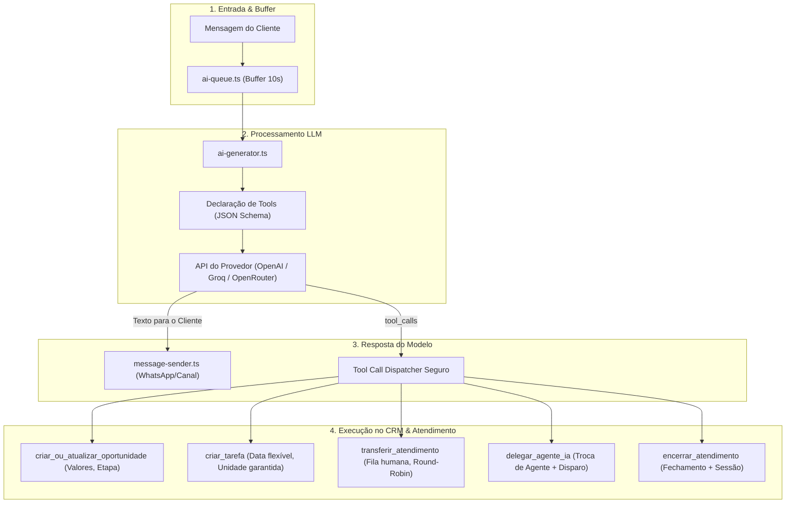

# 📋 Plano de Ação: Modernização e Correção dos Agentes de IA e Follow-up

> **Data:** Outubro de 2026  
> **Status:** ✅ Concluído e Validado em Produção  
> **Objetivo:** Eliminar a fragilidade das tags de texto no prompt (`[TAG: ...]`), migrar para **Native Tool Calling (Function Calling)** em todos os provedores (OpenAI, Groq e OpenRouter), corrigir a criação de tarefas/oportunidades no CRM, garantir a integridade de transferências (handoff) e implementar encerramento determinístico no ciclo de follow-up.

---

## 📌 1. Premissas e Contexto

1. **Garantia de Empresa e Unidade:** Toda conversa, oportunidade e tarefa pertence estritamente a uma **Empresa** (`company_id`) e a uma **Unidade** (`unit_id`). O sistema deve garantir a herança e propagação correta desses identificadores em qualquer ação executada pela IA.
2. **Fim da Fragilidade de Tags de Texto:** Modelos de linguagem não devem mais ser instruídos a cuspir marcações textuais como `[CRIAR_OPORTUNIDADE: ...]`, `[CRIAR_TAREFA: ...]`, `[TRANSFERIR: ...]` ou `[ENCERRAR]`. Em vez disso, o sistema fornecerá ferramentas estruturadas (**Tools / JSON Schema**), com retrocompatibilidade para tags legadas caso ocorram.
3. **Resolução Inteligente e Tolerante:** O modelo deve poder referenciar etapas do funil, departamentos e colegas por **nome amigável** (ex: *"Proposta"*, *"Comercial"*, *"Suporte"*), sendo resolvidos dinamicamente pelo backend para os respectivos UUIDs no banco de dados.

---

## 🏗️ 2. Arquitetura Alvo: Fluxo com Tool Calling Nativo

---

## 🎯 3. Fases Detalhadas de Execução

---

### 🔹 FASE 1: Motor de Tool Calling Nativo e Retrocompatibilidade
**Arquivo Alvo:** [`src/lib/server/ai-generator.ts`](file:///home/rhiangeraldo/Desenvolvimentos/Atendi/src/lib/server/ai-generator.ts)

* [x] **1.1 Definição do Schema Unificado de Ferramentas (`tools`)**:
  Declarar array de tools compatível com OpenAI, Groq e OpenRouter:
  * `criar_oportunidade`: Título, valor financeiro numérico (opcional, fallback 0), nome ou ID da etapa do funil.
  * `atualizar_oportunidade`: ID da oportunidade ou busca automática da oportunidade ativa do contato, com nova etapa desejada.
  * `criar_tarefa`: Título da tarefa, descrição, data/hora prevista de acompanhamento.
  * `transferir_atendimento`: Motivo do transbordo humano, departamento de destino sugerido.
  * `delegar_para_outro_agente_ia`: Nome ou ID do agente colega especialista, motivo da delegação.
  * `encerrar_atendimento`: Resumo do motivo de resolução com sucesso.
* [x] **1.2 Injeção Condicional de Ferramentas**:
  * Injetar apenas as ferramentas que o agente tem permissão para usar (`allow_tasks`, `allow_opportunities`, `allow_handoff`, `allow_resolution`, `allowed_agent_ids`).
* [x] **1.3 Suporte Híbrido e Retrocompatibilidade**:
  * Se o modelo invocar `tool_calls`, executar o handler estruturado.
  * Se o modelo responder em texto e ainda contiver tags legadas (`[TRANSFERIR]`, `[ENCERRAR]`, etc.), manter o extrator regex como fallback seguro para não quebrar instâncias existentes.
* [x] **1.4 Limpeza de Mensagens para o Cliente**:
  * Garantir que nenhum comando interno ou tag técnica seja enviado ao WhatsApp do cliente final.

---

### 🔹 FASE 2: Resolução Segura de Oportunidades e Funil de Vendas
**Arquivos Alvo:** [`src/lib/server/ai-generator.ts`](file:///home/rhiangeraldo/Desenvolvimentos/Atendi/src/lib/server/ai-generator.ts), [`src/types/crm-qualification.ts`](file:///home/rhiangeraldo/Desenvolvimentos/Atendi/src/types/crm-qualification.ts)

* [x] **2.1 Resolução de Etapas do Funil por Nome ou ID**:
  * Se o modelo enviar `etapa: "Negociação"`, buscar em `pipeline_stages` pelo nome (usando `ilike` e `pipeline_id`), evitando erros de chave estrangeira (FK) de UUID inválido.
  * Se nenhuma etapa for informada, adotar a primeira etapa do funil vinculado (`order_index = 0`).
* [x] **2.2 Parser Flexível de Moeda/Valor**:
  * Criar função auxiliar `parseCurrencyValue(val)` que aceite números diretos (`1500`), strings com moeda (`"R$ 1.500,00"` ou `"1500,50"`) e converta para float limpo (`1500.00`).
* [x] **2.3 Idempotência e Propagação de Empresa/Unidade**:
  * Obter `unit_id` da conversa (ou do contato/instância como fallback) e `company_id`.
  * Preencher `company_id`, `unit_id`, `contact_id`, `conversation_id`, `stage_id` e `status = 'open'`.
  * Registrar histórico na tabela `opportunity_history` com metadata da IA.

---

### 🔹 FASE 3: Parser Resiliente de Datas e Criação de Tarefas
**Arquivo Alvo:** [`src/lib/server/ai-generator.ts`](file:///home/rhiangeraldo/Desenvolvimentos/Atendi/src/lib/server/ai-generator.ts)

* [x] **3.1 Parser Natural de Datas para PostgreSQL (`parseTaskDueDate`)**:
  * Criar parser que interprete:
    * ISO 8601 (`2026-10-15T14:00:00Z`);
    * Formato brasileiro (`15/10/2026 14:00` ou `15/10/2026`);
    * Termos relativos em português: *"hoje"*, *"amanhã"*, *"daqui a X dias"*, *"segunda-feira"*, normalizando sempre com base no fuso horário oficial da empresa (`America/Sao_Paulo`).
    * Fallback seguro: se a data for ilegível, definir vencimento para 24 horas à frente (`now + 1 day`), impedindo que o insert no Postgres falhe.
* [x] **3.2 Inserção com Dados Completos**:
  * Inserir em `tasks` com `unit_id`, `contact_id`, `title`, `description`, `due_date`, `status = 'pending'`, `priority = 'medium'`, `task_type = 'follow_up'`.
  * Gerar a nota interna no chat informando o atendente humano da tarefa agendada.

---

### 🔹 FASE 4: Refatoração de Transferências (Handoff Humano e Multi-Agente)
**Arquivos Alvo:** [`src/lib/server/ai-generator.ts`](file:///home/rhiangeraldo/Desenvolvimentos/Atendi/src/lib/server/ai-generator.ts), [`src/lib/server/routing.ts`](file:///home/rhiangeraldo/Desenvolvimentos/Atendi/src/lib/server/routing.ts)

* [x] **4.1 Resolução de Colegas de IA por Nome ou UUID**:
  * Na função `delegar_para_outro_agente_ia`, permitir que o modelo envie o nome do agente (ex: *"Clara"*, *"Suporte"*) ou o ID.
  * O backend faz a correspondência com a lista de `allowed_agent_ids` autorizados daquele agente.
* [x] **4.2 Transferência sem Perda de Sessão**:
  * Atualizar `conversations.ai_agent_id` com o ID do novo agente.
  * Inserir registro em `session_events` com evento `transferred` e metadados (`targetType: 'agent'`).
  * Inserir mensagem de sistema invisível notificando o novo agente com o prompt `prompt_receive_handoff`.
  * Disparar imediatamente o novo agente via `enqueueAiMessage`.
* [x] **4.3 Transbordo Humano com Departamento Seguro**:
  * Se o departamento configurado no agente for válido, atribuir `department_id`.
  * Executar a distribuição Round-Robin vinculada estritamente à `unit_id` da conversa.
  * Inserir nota interna com o motivo e atualizar a sessão para aguardando (`waiting`).

---

### 🔹 FASE 5: Encerramento e Follow-up Determinísticos
**Arquivos Alvo:** [`src/lib/server/cron.ts`](file:///home/rhiangeraldo/Desenvolvimentos/Atendi/src/lib/server/cron.ts), [`src/lib/server/ai-generator.ts`](file:///home/rhiangeraldo/Desenvolvimentos/Atendi/src/lib/server/ai-generator.ts)

* [x] **5.1 Encerramento Confiável por Inatividade (`SYSTEM_RESOLVE_INACTIVE`)**:
  * Se o chamado atingir `ai_followup_count >= maxAttempts`, o `cron.ts` deve:
    1. Disparar a mensagem de encerramento amigável para o cliente;
    2. **Forçar o status `resolved` diretamente no banco de dados**, atualizando `conversation_sessions.resolution_reason_id` com o motivo de inatividade (`followup_resolution_reason_id`);
    3. Registrar o evento em `session_events`.
  * Isso elimina a dependência de o LLM lembrar de emitir uma tag voluntária, acabando com tickets órfãos e mensagens repetidas a cada minuto.
* [x] **5.2 Proteção contra Loops no Cron**:
  * Gravar `ai_last_followup_at = new Date().toISOString()` em todas as etapas de follow-up.
  * Impedir que o cron avalie conversas recém-notificadas antes de transcorrido o intervalo completo.

---

### 🔹 FASE 6: Atualização da Interface Visual e Orientações
**Arquivo Alvo:** [`src/components/settings/ai-agents-tab.tsx`](file:///home/rhiangeraldo/Desenvolvimentos/Atendi/src/components/settings/ai-agents-tab.tsx)

* [x] **6.1 Atualização de Tooltips e Textos de Ajuda**:
  * Atualizar os tooltips para esclarecer que a IA agora executa ações de forma **nativa e estruturada**, sem que o usuário precise memorizar ou digitar formatos de tags (`[TAG: ...]`).
  * Permitir que o usuário apenas forneça orientações de negócio (ex: *"Crie uma tarefa de retorno para 3 dias após a conversa"* ou *"Transfira para o Comercial se o cliente quiser orçamento"*).
* [x] **6.2 Validação de Campos Obrigatórios**:
  * Garantir que ao ativar "Permitir Criação de Oportunidades", o funil (`pipeline_id`) seja selecionado.

---

## 🧪 4. Roteiro de Testes e Homologação

| Cenário de Teste | Ação Executada | Resultado Esperado |
| :--- | :--- | :--- |
| **1. Criação de Oportunidade** | Cliente: *"Quero fechar o plano de R$ 1.500"* | IA aciona `criar_oportunidade`; card aparece no Kanban com R$ 1.500,00 na etapa inicial ou citada, com `company_id` e `unit_id` corretos. |
| **2. Criação de Tarefa** | Cliente: *"Pode me ligar amanhã às 15h?"* | IA aciona `criar_tarefa`; tarefa é criada no módulo de Tarefas para a data correta sem erro de sintaxe SQL. |
| **3. Transferência entre IAs** | Cliente pede suporte para IA de Vendas | IA aciona `delegar_para_outro_agente_ia`; agente de Suporte assume no mesmo instante e responde com continuidade de contexto. |
| **4. Transbordo Humano** | Cliente: *"Quero falar com uma pessoa"* | IA aciona `transferir_atendimento`; chamado vai para a fila do departamento com nota interna explicativa e sem vazamento de tags no WhatsApp. |
| **5. Follow-up por Inatividade** | Cliente para de responder por 15 minutos | Cron dispara 1º follow-up amigável. Se persistir inativo até o limite, envia despedida e encerra o ticket com motivo registrado no CRM. |
| **6. Encerramento com Sucesso** | Cliente: *"Muito obrigado, deu tudo certo!"* | IA se despede cordialmente e encerra o ticket (`resolved`), gerando evento de sucesso na sessão. |

---

## 🚀 5. Próximos Passos Imediatos

1. Aprovação deste plano de ação.
2. Início da execução pela **Fase 1 (Tool Calling em `ai-generator.ts`)** e **Fase 2 (CRM & Tarefas)**.
3. Teste ponta a ponta com instâncias ativas de WhatsApp.
