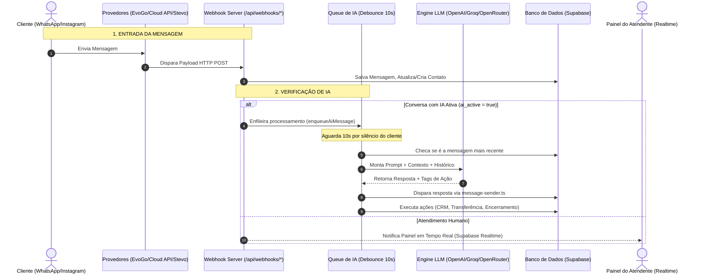

# Análise Técnica e Operacional do Módulo de Atendimentos e Comunicação por IA — Plataforma Atendi

Este documento fornece uma análise profunda e detalhada do **Módulo de Atendimentos** da plataforma **Atendi**, abrangendo desde o recebimento de mensagens multi-canal via Webhooks, passando pela arquitetura completa e autônoma da **Inteligência Artificial (IA)**, até os mecanismos de envio, gestão de filas e ciclo de vida do chamado.

---

## 🏗️ 1. Visão Geral da Arquitetura de Atendimentos

O Módulo de Atendimentos do Atendi opera como uma plataforma **Omnichannel Multi-Tenant e Multi-Unidade**. Todas as mensagens recebidas via **WhatsApp** (EvoGo, Stevo, Cloud API), **Instagram Direct**, **Messenger** ou **Wavoip** são consolidadas em uma única engine de conversas no banco de dados.



---

## 📥 2. Como Chegam as Mensagens (Mecanismo de Ingestão e Webhooks)

### 2.1 Provedores de Canal Suportados
A plataforma suporta múltiplos provedores através de roteadores de webhook dedicados no servidor (`src/server.ts`):

1. **EvoGo** (`/api/webhooks/evogo`): Suporta a engine EvoGo/WhatsMeow e Baileys.
2. **StevoChat** (`/api/webhooks/stevo`): Suporta instâncias Stevo.
3. **WhatsApp Cloud API** (`/api/webhooks/whatsapp`): Suporta a API oficial Meta Cloud.
4. **Instagram Direct** (`/api/webhooks/instagram`): Recebe mensagens de Directs e respostas a Stories.
5. **Facebook Messenger** (`/api/webhooks/messenger`): Integração com páginas do Facebook.
6. **Wavoip** (`/api/wavoip/webhook`): Processa chamadas telefônicas e logs de voz via WhatsApp.

---

### 2.2 Pipeline de Processamento de Entrada no Webhook

Quando uma mensagem atinge qualquer webhook da plataforma, os seguintes passos são executados estritamente nesta ordem:

#### 1. Resolução de Identidade e Unificação de Contato (LID Resolution)
* **Unificação CTWA/LID**: Em mensagens provenientes de anúncios no WhatsApp (Click-to-WhatsApp), a Meta envia um `JID` temporário (`@lid`). O webhook intercepta o evento `PushName` ou payloads de contexto para converter o `@lid` no número real (`@s.whatsapp.net`), garantindo que o histórico do cliente nunca seja duplicado.
* **Busca e Criação de Contato**: O sistema busca o contato pelas variações do número de telefone (com ou sem o 9º dígito). Se o contato não existir, ele é criado automaticamente no CRM e sua **foto de perfil é sincronizada** no mesmo instante.

#### 2. Localização e Gestão do Chamado (Conversa)
* O sistema busca se existe um chamado ativo (`status = 'waiting'` ou `status = 'active'`) vinculado àquela instância e contato.
* **Reabertura Automática de Chamados**: Se a mensagem vier em um chamado que consta como **`resolved`** (Resolvido), a plataforma o **reabre automaticamente**:
  * Para **`active`**, se a IA já estava configurada para atender aquele cliente; ou
  * Para **`waiting`**, encaminhando o cliente para a fila de espera do departamento humano.

#### 3. Salvamento e Deduplicação da Mensagem
* A mensagem é validada pelo ID remoto (`remote_msg_id`). Se for uma mensagem duplicada enviada pelo provedor, ela é ignorada.
* São processados e armazenados os seguintes tipos de mídias: **Texto, Imagem, Vídeo, Vídeo Instantâneo (PTV), Áudio (OGG), Documentos, Figurinhas (Stickers), Localização, VCards de Contatos e Enquetes**.
* Caso a mensagem venha editada ou seja apagada para todos no WhatsApp, o webhook intercepta o evento `protocolMessage` e atualiza a mensagem original no banco de dados.

---

## 🤖 3. Comunicação da Inteligência Artificial (AI Agents System)

A IA no Atendi não é apenas um chatbot simples de resposta, mas sim um **Agente Autônomo com Capacidades Executivas no CRM e Orquestração Multi-Agentes**.

---

### 3.1 O Buffer de Silêncio do Cliente (Debounce Queue de 10 Segundos)

Para evitar que a IA responda a cada frase solta enviada por clientes que digitam em várias mensagens picadas (ex: "Olá", "Tudo bem?", "Queria saber o preço"), o Atendi implementou uma **Queue com Buffer de Silêncio (`ai-queue.ts`)**:

1. Quando a mensagem do cliente chega, o webhook chama `enqueueAiMessage(conversationId, messageId)`.
2. A fila aguarda **10 segundos** (`BUFFER_MS = 10000`).
3. Após 10 segundos, o sistema faz uma consulta no banco de dados. Se a última mensagem da conversa **ainda for a mensagem que iniciou o timer**, significa que o cliente parou de digitar.
4. Se o cliente tiver enviado uma nova mensagem durante esses 10 segundos, o timer anterior é descartado e o novo timer assume. A IA é disparada **apenas uma vez** com todo o contexto acumulado.

---

### 3.2 Montagem de Prompts e Variáveis Dinâmicas (`ai-generator.ts`)

A engine de IA lê o perfil do agente cadastrado (`ai_agents`), a empresa (`companies`) e a unidade (`units`), interpolando dinamicamente o System Prompt antes de consultar o LLM.

#### Variáveis Substituídas em Tempo Real:
* `{{nome_cliente}}`: Nome cadastrado do contato.
* `{{telefone}}`: Telefone do cliente.
* `{{info_empresa}}`: Nome, CNPJ, Endereço, Horário de Funcionamento e variáveis da Empresa Mãe.
* `{{info_unidade}}`: Dados específicos da Filial/Unidade na qual o cliente está sendo atendido.
* `{{cnpj}}`, `{{endereco}}`, `{{horarios}}`: Substituição direta com fallback da Unidade para a Empresa.

---

### 3.3 Orquestração Multi-Agentes (Trabalho em Equipe entre IAs)

Um agente de IA pode ter uma lista de **"Agentes Colegas"** autorizados (`allowed_agent_ids`).
* Se um cliente for atendido pela **IA de Triagem** e solicitar um orçamento, a IA de Triagem pode decidir transferir o chamado para a **IA Especialista em Vendas**.
* A IA insere a tag `[TRANSFERIR_AGENTE: id_agente_destino]` na sua resposta.
* O sistema atualiza `ai_agent_id` na conversa, insere uma mensagem de sistema e **dispara imediatamente o novo agente de IA** para responder ao cliente sem interromper a conversa.
* **Proteção contra Loop Infinito**: Se houver mais de 3 transferências entre IAs em um intervalo de 5 minutos, o sistema intercepta e transfere automaticamente o chamado para um atendente humano.

---

### 3.4 Ferramentas e Ações Autônomas da IA no CRM

A IA analisa o contexto e pode executar ações no sistema inserindo **Tags Especiais** que são lidas e interpretadas pelo backend (`ai-generator.ts`):

```mermaid
flowchart LR
    LLM[Resposta do Modelo LLM] --> TagCheck{Possui Tag Especial?}
    
    TagCheck -- "[TRANSFERIR: motivo]" --> Handoff[Desativa IA (ai_active=false) e Manda para Fila Humana]
    TagCheck -- "[ENCERRAR: motivo]" --> Resolve[Encerra o Chamado (status=resolved)]
    TagCheck -- "[TRANSFERIR_AGENTE: id]" --> SwitchAI[Troca o Agente de IA Responsável]
    TagCheck -- "[CRIAR_TAREFA: ...]" --> Task[Cria Tarefa no Módulo CRM]
    TagCheck -- "[CRIAR_OPORTUNIDADE: ...]" --> OppCreate[Cria Oportunidade no Funil Kanban]
    TagCheck -- "[ATUALIZAR_OPORTUNIDADE: ...]" --> OppUpdate[Move Oportunidade de Etapa no Funil]
```

1. **Handoff Humano Automático (`[TRANSFERIR: motivo]`)**:
   * Ocorre quando o cliente pede um humano ou a IA atinge o limite do seu conhecimento.
   * O sistema altera `ai_active = false`, atribui o chamado para a fila do departamento configurado (`handoff_department_id`) ou atribui via **Round-Robin**, e cria uma **Nota Interna** com o motivo da transferência.

2. **Resolução Autônoma (`[ENCERRAR: resumo]`)**:
   * Quando a dúvida do cliente é sanada ou ele se despede, a IA inclui essa tag.
   * O sistema altera o status da conversa para `resolved`, grava a justificativa de encerramento na sessão do atendimento e encerra o chamado.

3. **Criação de Tarefas no CRM (`[CRIAR_TAREFA: Título | Descrição | Data]`)**:
   * A IA agenda automaticamente um follow-up ou tarefa para a equipe comercial/suporte no módulo de tarefas.

4. **Gestão do Funil de Vendas (`[CRIAR_OPORTUNIDADE]` / `[ATUALIZAR_OPORTUNIDADE]`)**:
   * Se o cliente demonstrar interesse de compra, a IA cria um card no **Kanban de Oportunidades** vinculando o valor estimado e o estágio inicial. Se o card já existir, a IA o move de etapa conforme a negociação avança.

---

### 3.5 Ciclo de Follow-ups e Encerramento por Inatividade (`cron.ts`)

A plataforma possui um serviço contínuo de varredura (`handleCronFollowUps`) rodando a cada 1 minuto:

1. **Identificação de Inatividade**: Varre conversas onde `ai_active = true` e o cliente não responde há mais de X minutos (definido no cadastro do agente, ex: 15 min).
2. **1º Aviso (`SYSTEM_FOLLOW_UP_1`)**: Insere uma mensagem de sistema instruindo a IA a enviar uma mensagem amigável perguntando se o cliente ainda precisa de ajuda.
3. **2º Aviso (`SYSTEM_FOLLOW_UP_2`)**: Se o cliente continuar em silêncio por mais um intervalo, a IA envia um aviso de que o atendimento será encerrado em breve.
4. **Encerramento por Falta de Comunicação (`SYSTEM_RESOLVE_INACTIVE`)**: Se o cliente ignorar os avisos, a IA se despede cordialmente e encerra o chamado automaticamente.

---

## 💬 4. Ciclo de Vida do Atendimento (Estados e Transições)

O gerenciamento de chamados humanos é estruturado em três abas no painel:

### 1. 📥 Status: `AGUARDANDO` (Fila de Espera)
* Todas as conversas que ainda não foram assumidas por nenhum atendente humano ficam nesta aba.
* **Mecanismos de Distribuição**:
  * **Manual**: O atendente visualiza a fila do seu departamento e clica em "Assumir".
  * **Automático (Round-Robin)**: O sistema distribui o chamado para o agente disponível com menor número de atendimentos abertos.

### 2. 💬 Status: `EM ANDAMENTO` (Atendimento Ativo)
* O atendente possui acesso ao chat em tempo real com envio de mídias, áudios, templates e respostas rápidas (`/atalhos`).
* **Notas Internas**: O atendente pode mandar mensagens confidenciais visíveis apenas para a equipe (com fundo diferenciado).
* **Transferências**: Permite transferir a conversa para outro atendente, outro departamento ou outra unidade da empresa.

### 3. ✅ Status: `RESOLVIDO` (Histórico)
* O atendente clica em "Encerrar Atendimento", informando o motivo da resolução.
* A conversa é arquivada, e métricas como **TMA** (Tempo Médio de Atendimento) e **SLA de Primeira Resposta** são calculadas e enviadas aos relatórios.

---

## 📤 5. Mecanismo Unificado de Envio de Mensagens (`message-sender.ts`)

Para garantir que nenhuma mensagem seja enviada duplicada ou pelo canal errado, tanto a **IA** quanto os **Atendentes Humanos** utilizam a função centralizada `sendPlatformMessage`:

* A função identifica automaticamente se a conversa é de **WhatsApp (EvoGo/Stevo/Cloud API)**, **Instagram** ou **Messenger**.
* Seleciona as credenciais corretas da instância vinculada àquela Unidade ou Empresa.
* Converte arquivos e áudios para os formatos aceitos pelas APIs externas.
* Salva a mensagem no banco de dados Supabase e dispara os eventos do **Supabase Realtime**, atualizando instantaneamente a tela de todos os atendentes conectados.

---

## 🚀 6. Recursos Adicionais de Atendimento

### 6.1 Sales Coach com IA (`salesCoachAction`)
* Durante o atendimento humano, o atendente pode acionar o **Sales Coach**.
* A IA lê as últimas 20 mensagens da conversa e sugere respostas estratégicas, técnicas de contorno de objeções e próximos passos para fechar a venda.

### 6.2 Transcrição Automática de Áudios (`transcribeAudioAction`)
* Áudios recebidos dos clientes são automaticamente transcritos para texto, permitindo que a IA os leia na íntegra e que os atendentes leiam o conteúdo sem precisar ouvir o áudio.

---

*Documentação do Módulo de Atendimentos e IA — Plataforma Atendi*
