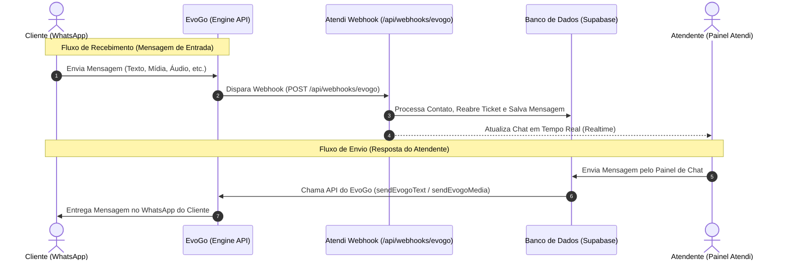

# Integration EvoGo — Módulo de Atendimento Atendi

Este documento apresenta a documentação completa de como o **EvoGo** (Engine de integração WhatsApp) é utilizado na plataforma **Atendi**, abrangendo desde o funcionamento do chat e envio de respostas até o detalhamento técnico e operacional da **rota de Webhook**.

---

## 📐 1. Arquitetura da Integração

O **EvoGo** atua como a ponte de comunicação entre os servidores do WhatsApp e a plataforma **Atendi**:



---

## ⚡ 2. Rota de Webhook (`/api/webhooks/evogo`)

A rota de Webhook é o ponto central onde o Atendi recebe todos os eventos em tempo real enviados pelo EvoGo.

* **URL Principal**: `POST /api/webhooks/evogo`
* **URL Legada (Retrocompatibilidade)**: `POST /api/evogo/webhook`
* **Resposta do servidor**: HTTP `200 OK`

---

### 2.1 Eventos Processados no Webhook

O webhook processa dois formatos principais de payloads (WhatsMeow/EvoGo nativo e formato Baileys/Evolution):

#### 1. `PushName` (Unificação CTWA / LID)
Resolve identificadores temporários da API do WhatsApp (`@lid`) para o número de telefone real do cliente (`@s.whatsapp.net`).
* Associa o `whatsapp_lid` ao contato no banco de dados.
* Atualiza o nome de exibição (`PushName`).

#### 2. `Message` / `SendMessage` / `messages.upsert` (Recebimento de Mensagens)
Identifica se a mensagem foi enviada pelo cliente ou pelo próprio atendente/instância (`IsFromMe` / `fromMe`).

#### 3. `protocolMessage` (Edição e Exclusão)
* **Edição de Mensagem** (`type: 14` / `MESSAGE_EDIT`): Atualiza o texto da mensagem no chat mantendo o prefixo `✏️ Editado:`.
* **Apagar para Todos** (`type: 0` / `REVOKE`): Marca a mensagem como excluída (`is_deleted: true`) no painel.

#### 4. `reactionMessage` / `reaction` (Reações com Emojis)
Adiciona ou remove reações de emojis vinculadas à mensagem correspondente pelo `remote_msg_id`.

---

### 2.2 Suporte a Tipos de Mensagem e Mídias no Webhook

| Tipo de Mensagem | Tratamento e Extração no Webhook | Visualização no Chat do Atendi |
|---|---|---|
| **Texto Simples** | Extrai `conversation` ou `extendedTextMessage.text` | Balão de texto normal |
| **Imagem** | Descriptografa base64 nativo ou thumbnail JPEG | Imagem em alta definição com suporte a modal/zoom e legenda |
| **Áudio / Voz** | Extrai áudio em formato base64 OGG | Player de áudio com controle de velocidade (1x, 1.5x, 2x) e transcrição automática por IA |
| **Vídeo & Vídeo Instantâneo (PTV)** | Extrai base64 MP4 ou thumbnail | Player de vídeo embutido (incluindo formato circular para PTV) |
| **Documentos** | Processa PDF, DOCX, XLSX, etc. | Card de arquivo com botão para download e nome do documento |
| **Figurinhas (Stickers)** | Processa WebP | Exibição de sticker sem fundo no chat |
| **Localização** | Extrai latitude, longitude, nome e endereço | Card com mapa/localização clicável |
| **Contatos (VCard)** | Analisa formato VCard (`FN`, `TEL`, `waid`, `PHOTO`) | Card de contato com opção de salvar/iniciar conversa |
| **Enquetes** | Extrai pergunta e lista de opções | Exibição da enquete estruturada |
| **Respostas a Anúncios (CTWA)** | Extrai metadata de origem de campanha | Card com origem do anúncio (Facebook/Instagram Ads) |

---

### 2.3 Lógica Interna de Processamento do Webhook

Ao receber uma nova mensagem, o Atendi executa os seguintes passos:

1. **Localização da Instância**: Identifica a instância do WhatsApp cadastrada (`whatsapp_instances`) pelo `instanceName`.
2. **Deduplicação de Mensagens**: Verifica se o `remote_msg_id` já existe no banco para evitar duplicidade.
3. **Gestão de Contato**:
   * Busca por variação de número de telefone (com/sem 9º dígito).
   * Se existir, atualiza dados (ex: foto de perfil e nome).
   * Se não existir, cria o contato automaticamente e sincroniza foto de perfil.
4. **Gestão de Conversa (Atendimento)**:
   * Localiza a conversa ativa para aquela instância e contato.
   * **Reabertura Automática**: Se a conversa estiver no status **`resolved`**, o webhook a reabre automaticamente:
     * Para **`waiting`** (Aguardando na fila do departamento); ou
     * Para **`active`** (Em andamento com a IA ativada).
5. **Encaminhamento para IA (Queue)**:
   * Se a conversa estiver com o agente de IA ativo (`ai_active: true`), a mensagem é enfileirada no worker de IA (`enqueueAiMessage`) para geração de resposta automática.

---

## 💬 3. Funcionamento do Chat e Envio de Respostas

O atendente opera o chat diretamente pela interface web do Atendi (`/conversations`). Todas as ações de envio utilizam a biblioteca de integração EvoGo (`src/lib/evogo.ts`).

### 3.1 Funções de Envio do EvoGo

#### Envio de Texto e Links
```typescript
// Envia mensagem de texto simples ou com preview de link
sendEvogoText({
  host: instance.server_url,
  token: instance.token,
  instanceName: instance.instance_name,
  number: contact.phone,
  text: "Olá! Como posso ajudar?",
  quoted: { messageId: "remote_id_da_mensagem_citada" } // opcional
});
```

#### Envio de Mídia (Imagens, Áudios, Vídeos, Documentos)
```typescript
// Envia mídias convertidas em base64
sendEvogoMedia({
  host: instance.server_url,
  token: instance.token,
  instanceName: instance.instance_name,
  number: contact.phone,
  base64: "data:image/jpeg;base64,/9j/4AAQSkZJRg...",
  mediatype: "image", // 'image' | 'video' | 'audio' | 'document'
  caption: "Segue a foto solicitada"
});
```

#### Reações com Emojis
```typescript
sendEvogoReaction({
  host: instance.server_url,
  token: instance.token,
  number: contact.phone,
  remoteMsgId: message.remote_msg_id,
  emoji: "👍"
});
```

#### Edição e Exclusão de Mensagens
```typescript
// Editar mensagem enviada
editEvogoMessage({ host, token, number, remoteMsgId, message: "Texto corrigido" });

// Apagar mensagem para todos no WhatsApp
deleteEvogoMessage({ host, token, number, remoteMsgId });
```

---

## ⚙️ 4. Gestão de Instâncias e Conexão QR Code

### 4.1 Conexão da Instância
Para conectar um novo número de WhatsApp ao Atendi via EvoGo:
1. O administrador acessa as configurações da unidade/empresa.
2. Clica em **"Conectar WhatsApp"** (dispara requisição para criar/obter QR Code no EvoGo).
3. O EvoGo retorna a string de imagem do QR Code.
4. O usuário lê o QR Code com o aplicativo WhatsApp do celular.
5. O EvoGo envia evento de conexão e o status da instância muda para **`connected`** no Atendi.

### 4.2 Webhook Auto-Configurado
Ao conectar uma instância, o Atendi configura automaticamente a URL de webhook no EvoGo:
```json
{
  "subscribe": ["ALL"],
  "webhookUrl": "https://seu-dominio.com.br/api/webhooks/evogo"
}
```

---

## 📋 5. Resumo das APIs do EvoGo Utilizadas

| Funcionalidade | Rota EvoGo | Método | Descrição |
|---|---|---|---|
| **Criar Instância** | `/instance/create` | `POST` | Cria uma nova instância no servidor EvoGo |
| **Conectar / QR Code** | `/instance/connect` | `POST` | Gera o QR Code e registra a URL do Webhook |
| **Status da Conexão** | `/instance/status` | `GET` | Verifica se a instância está conectada |
| **Desconectar/Deletar** | `/instance/delete/:instanceId` | `DELETE` | Remove a instância do EvoGo |
| **Enviar Texto** | `/send/text` | `POST` | Envia mensagem de texto |
| **Enviar Mídia** | `/send/media` | `POST` | Envia imagens, áudios, vídeos e documentos |
| **Enviar Reação** | `/message/react` | `POST` | Envia reação com emoji |
| **Editar Mensagem** | `/message/edit` | `POST` | Edita mensagem já enviada |
| **Apagar Mensagem** | `/message/delete` | `POST` | Deleta mensagem para todos |

---

*Documentação de Integração EvoGo — Plataforma Atendi*
