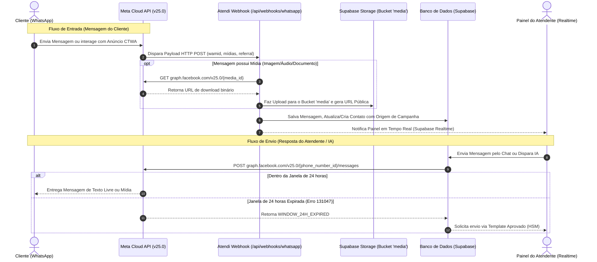

# Integração Oficial WhatsApp Cloud API (Meta Graph API) — Plataforma Atendi

Este documento fornece a documentação técnica completa da integração entre a plataforma **Atendi** e a **API Oficial do WhatsApp Business (WhatsApp Cloud API)** fornecida diretamente pela Meta (Graph API `v25.0`).

---

## 📐 1. Arquitetura da Integração Cloud API

Diferente das engines baseadas em emulação de protocolo (WhatsMeow/Baileys), a **Cloud API** estabelece comunicação direta e oficial via HTTP REST e Webhook seguro entre a Meta e o servidor do Atendi:



---

## 🔑 2. Estrutura de Credenciais na Instância (`whatsapp_instances`)

Para habilitar a API Oficial em uma instância no Atendi, os seguintes campos da tabela `whatsapp_instances` são utilizados:

| Campo no Banco | Tipo | Descrição |
|---|---|---|
| `oficial_phone_number_id` | `TEXT` | ID único do número de telefone no painel Meta Business |
| `oficial_waba_id` | `TEXT` | WhatsApp Business Account ID (WABA ID) |
| `oficial_access_token` | `TEXT` | Token de Acesso Permanente de Usuário do Sistema (System User Token) |
| `oficial_verify_token` | `TEXT` | Token customizado de verificação do Webhook gerado pelo Atendi |
| `provider` | `TEXT` | Definido como `'whatsapp_cloud'` |

---

## ⚡ 3. Handshake e Validação do Webhook (`/api/webhooks/whatsapp`)

A rota de Webhook trata tanto a verificação inicial da Meta (solicitação `GET`) quanto a ingestão contínua de eventos (`POST`).

### 3.1 Verificação do Handshake (`GET /api/webhooks/whatsapp`)
Quando o Webhook é cadastrado no painel do Meta Developers, a Meta envia uma requisição `GET` de verificação:

* **Parâmetros da Querystring**:
  * `hub.mode`: Deve ser `subscribe`.
  * `hub.verify_token`: O token configurado no painel da Meta.
  * `hub.challenge`: Uma string numérica aleatória enviada pela Meta.

* **Lógica no Atendi**:
  1. O Atendi busca no banco se existe alguma instância com `oficial_verify_token` igual a `hub.verify_token`.
  2. Se encontrado, o Atendi responde com HTTP status `200 OK` contendo **apenas o conteúdo bruto de `hub.challenge`** no corpo da resposta.
  3. Se não encontrado, responde HTTP `403 Forbidden`.

---

## 📥 4. Ingestão de Eventos e Processamento no Webhook (`POST`)

Ao receber um payload da Meta, o Atendi responde imediatamente HTTP `200 EVENT_RECEIVED` e processa os dados assincronamente.

### 4.1 Eventos Processados no Webhook

#### 1. Mensagens de Entrada (`messages`)
* **Texto**: Processa `message.text.body`.
* **Mídias (Imagem, Vídeo, Áudio, Documentos, Stickers)**: Extrai o `media_id`, executa o download da Meta Graph API com o `oficial_access_token`, envia para o **Supabase Storage** e armazena a URL pública permanente.
* **Contatos (VCards)**: Extrai nomes e telefones recebidos.
* **Respostas Interativas & Botões**: Processa seleções de botões (`button_reply`) e listas (`list_reply`).
* **Mensagens Editadas**: Intercepta `type: 'edit'`, localiza a mensagem original pelo `remote_msg_id` e atualiza o texto adicionando o sufixo `(editado)`.

#### 2. Status de Entrega e Leitura (`statuses`)
Rastreia a evolução da mensagem através dos eventos enviados pela Meta:
* `sent`: Mensagem enviada pelos servidores da Meta.
* `delivered`: Mensagem entregue no celular do cliente.
* `read`: Mensagem lida pelo cliente (atualiza `read_at` no banco).
* `failed`: Falha no envio. Se o código de erro for `131047`, marca que a **janela de 24 horas está expirada**.

#### 3. Origem de Anúncios — Click to WhatsApp (`referral`)
Quando um cliente clica em um anúncio no Facebook ou Instagram e inicia uma conversa:
* O webhook extrai o objeto `referral` (`source_url`, `headline`, `body`, `source_id`).
* Salva a origem da campanha no cadastro do contato (`source = 'Facebook Ads'` ou `'Instagram Ads'`), permitindo métricas de ROI e conversão no CRM.

#### 4. Sincronização de Templates HSM (`message_template_*_update`)
Sempre que um template de mensagem é aprovado (`APPROVED`), rejeitado (`REJECTED`) ou tem sua categoria/qualidade alterada na Meta, o webhook intercepta o evento e dispara automaticamente a sincronização dos templates (`syncCloudTemplates`).

#### 5. Qualidade da Linha e Alertas de Conta
* `phone_number_quality_update`: Monitora a saúde do número (Verde, Amarelo, Vermelho) e os limites diários de envio (Tiers: 1K, 10K, 100K ou ilimitado).
* `account_alerts` & `errors`: Registra alertas ou bloqueios temporários na instância no banco de dados.

---

## 📤 5. Mecanismo de Envio (`sendCloudApiMessage`)

O envio de mensagens via Cloud API é realizado chamando o endpoint da Meta:

* **URL**: `POST https://graph.facebook.com/v25.0/{oficial_phone_number_id}/messages`
* **Header**: `Authorization: Bearer {oficial_access_token}`

### 5.1 Regra da Janela de 24 Horas (Session Window)
* **Atendimento Ativo (< 24h)**: Se o cliente respondeu nas últimas 24 horas, o Atendi pode enviar qualquer tipo de mensagem de texto livre ou mídia livre.
* **Janela Expirada (> 24h)**: Se passarem mais de 24 horas da última mensagem do cliente, a Meta bloqueia o envio de texto livre com o erro `131047` (`WINDOW_24H_EXPIRED`). O envio passa a ser permitido **apenas através de Templates HSM Pré-Aprovados**.

### 5.2 Algoritmo de Variações de Número (Phone Fallback)
Devido às diferenças internacionais de formatação de número no Brasil (presença ou ausência do 9º dígito):
1. O Atendi gera as variações do número do cliente via `getPhoneVariants(phone)`.
2. Tenta o envio com a primeira variação.
3. Se a Meta retornar erro `131026` (número não existe no WhatsApp) ou `131030`, a plataforma tenta automaticamente a próxima variação antes de falhar.

---

## 📋 6. Sincronização de Templates HSM (`syncCloudTemplates`)

Para gerenciar modelos de mensagens aprovados no Meta Business Manager:

1. O Atendi chama `GET https://graph.facebook.com/v25.0/{oficial_waba_id}/message_templates?limit=100`.
2. Extrai a lista de templates com nome, idioma (`pt_BR`, `en_US`), status e componentes (Header, Body, Footer, Buttons).
3. Executa um `upsert` no Supabase na tabela `whatsapp_templates` utilizando a chave de conflito `(whatsapp_instance_id, name, language)`.

### 6.1 Exemplo de Payload para Envio de Template via API:
```json
{
  "messaging_product": "whatsapp",
  "recipient_type": "individual",
  "to": "5511999998888",
  "type": "template",
  "template": {
    "name": "confirmacao_agendamento",
    "language": { "code": "pt_BR" },
    "components": [
      {
        "type": "body",
        "parameters": [
          { "type": "text", "text": "João Silva" },
          { "type": "text", "text": "15/10/2026 às 14:00" }
        ]
      }
    ]
  }
}
```

---

## 📊 7. Resumo dos Códigos de Erro Mais Comuns da Meta

| Código de Erro | Significado | Ação Recomendada no Atendi |
|---|---|---|
| **`131047`** | Janela de 24 horas expirada | Exibir aviso na interface e forçar envio por Template HSM |
| **`131026`** | Número de telefone não cadastrado no WhatsApp | Testar variação do 9º dígito ou notificar número inválido |
| **`131030`** | Número não permitido (Sandbox/Test Number) | Adicionar o número como testador no painel Meta Developers |
| **`190`** | Access Token expirado ou inválido | Solicitar atualização do System User Token na instância |
| **`130429`** | Limite de taxa de requisições excedido (Rate Limit) | Aguardar intervalo e re-enfileirar mensagem |

---

*Documentação Técnica WhatsApp Cloud API — Plataforma Atendi*
