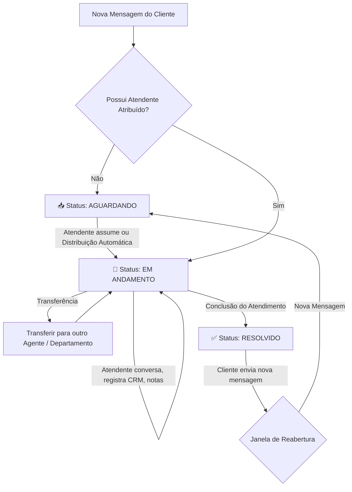

# Fluxo de Atendimento — Plataforma Atendi

Este documento descreve detalhadamente o **fluxo operacional de atendimento ao cliente** na plataforma **Atendi**, explicando como as conversas transitam entre os estados (**Aguardando**, **Em Andamento** e **Resolvido**), as ações disponíveis em cada etapa e a dinâmica de canais e permissões.

---

## 📱 1. Visão Geral dos Canais e Entrada de Mensagens

A plataforma **Atendi** é um sistema **Omnichannel** centralizado. Todas as conversas iniciadas pelos clientes em diferentes canais chegam em uma única caixa de entrada (*Inbox*), mantendo o histórico unificado por contato.

### Canais Suportados
* **WhatsApp**: Suporte a mensagens de texto, imagens, vídeos, áudios, documentos e mensagens de modelo (templates).
* **Instagram Direct**: Suporte a mensagens de texto, mídias e respostas a stories.

---

## 🔄 2. O Ciclo de Vida do Atendimento (Fluxo de Estados)

O atendimento é estruturado em três estados principais na plataforma, representados por abas no painel:

---

## 📥 3. Estado: AGUARDANDO (Fila de Espera)

### 3.1 O que ocorre nesta etapa?
Quando um cliente envia uma mensagem (pelo WhatsApp ou Instagram Direct):
1. **Identificação do Contato**: O sistema busca o cadastro do cliente pelo número/identificador. Se não existir, cria um novo contato automaticamente.
2. **Roteamento Inicial**: A conversa é direcionada para a **Unidade** e **Departamento** correspondentes (com base em horário de atendimento, canal ou menu de triagem/IA).
3. **Fila de Espera**: A conversa fica registrada na aba **"Aguardando"**.

### 3.2 Indicadores e Visualização
* **Tempo de Espera**: Exibe há quanto tempo o cliente aguarda o primeiro atendimento humano.
* **Canal de Origem**: Ícone identificando se veio via WhatsApp ou Instagram.
* **Prévia da Mensagem**: Exibição da última mensagem recebida.

### 3.3 Atribuição do Atendimento
Para a conversa sair de *Aguardando* e ir para *Em Andamento*, pode ocorrer de duas formas:
* **Manual**: O atendente visualiza a fila do seu departamento e clica em **"Assumir Atendimento"**.
* **Automática (Round-Robin)**: O sistema atribui automaticamente a conversa para o agente disponível com menor número de atendimentos ativos.

---

## 💬 4. Estado: EM ANDAMENTO (Atendimento Activo)

### 4.1 O que ocorre nesta etapa?
Quando o atendimento é assumido, a conversa é movida para a aba **"Em Andamento"** e fica sob responsabilidade do atendente designado.

### 4.2 Recursos Disponíveis para o Atendente
Durante a conversa ativa, o atendente pode utilizar os seguintes recursos:

* **Comunicação Multimídia**: Envio de textos, áudios gravados na hora, imagens, vídeos e documentos.
* **Respostas Rápidas & Templates**: Uso de atalhos de texto e modelos pré-configurados para agilizar respostas recorrentes.
* **Notas Internas**: Registro de anotações privadas sobre o cliente ou caso. *Essas notas são visíveis apenas para a equipe e não são enviadas ao cliente.*
* **Etiquetas (Tags)**: Categorização da conversa ou do contato (ex: `Lead Quente`, `Suporte Técnico`, `Financeiro`, `VIP`).
* **Integração com CRM**:
  * Criação e vinculação de **Oportunidades de Venda** (inserindo no Funil Kanban).
  * Criação de **Agendamentos** de reuniões ou serviços.
  * Cadastro e atualização dos dados do contato.

### 4.3 Transferência de Atendimento
Caso seja necessário redirecionar o cliente, o atendente pode realizar a **Transferência**:
* **Para outro Atendente**: Envia o atendimento diretamente para um colega específico do mesmo setor.
* **Para outro Departamento/Setor**: Envia o atendimento para a fila de outro setor (ex: do *Comercial* para o *Suporte*).
* **Para outra Unidade**: Transfere o atendimento para uma filial/unidade diferente da empresa.

---

## ✅ 5. Estado: RESOLVIDO (Finalizado)

### 5.1 Encerramento do Atendimento
Quando a solicitação do cliente é concluída, o atendente clica em **"Encerrar Atendimento"** ou **"Resolver"**.

### 5.2 O que ocorre ao encerrar?
1. A conversa é alterada para o status **"Resolvido"** e sai da aba ativa do atendente.
2. A conversa fica armazenada no histórico da aba **"Resolvido"** para futuras consultas ou auditorias.
3. **Métricas Registradas**: O sistema computa o **TMA** (Tempo Médio de Atendimento), o tempo de primeira resposta e o responsável pelo encerramento.
4. **Pesquisa de Satisfação (Opcional)**: Pode ser disparada uma mensagem automática convidando o cliente a avaliar o atendimento (avaliação CSAT).

---

## 🔁 6. Reabertura de Atendimento

O fluxo de atendimento é dinâmico e contínuo:
* Se um cliente cujo atendimento consta como **Resolvido** enviar uma **nova mensagem**, o sistema reabre a conversa.
* Dependendo das regras de negócio configuradas:
  * A conversa retorna para o status **"Aguardando"** na fila do departamento; **ou**
  * Retorna em **"Em Andamento"** para o último atendente responsável (caso esteja online e dentro do horário operacional).
* Todo o histórico de atendimentos anteriores do cliente permanece preservado e acessível na barra lateral.

---

## 👥 7. Perfis e Permissões no Fluxo

| Perfil | Ações no Fluxo de Atendimento |
|---|---|
| **Atendente** | Atende conversas da sua fila/departamento, responde mensagens, cria notas, aplica tags, movimenta CRM, efetua transferências e encerra atendimentos. |
| **Gerente de Unidade** | Monitora a fila da unidade em tempo real, visualiza conversas de todos os departamentos da unidade, reatribui ou assume atendimentos e analisa métricas. |
| **Administrador** | Possui acesso global a todas as filas e unidades, visualiza relatórios consolidados e gerencia regras de roteamento. |

---

*Documentação do Módulo de Atendimento — Plataforma Atendi*
